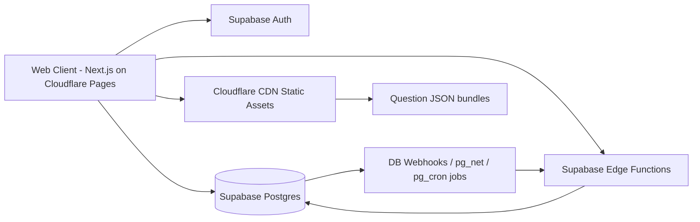

# Arena Masterplan — Supabase/Cloudflare Native Architecture (Duel-Only v1)

**Version:** 3.0 (critical-review rewrite)  
**Status:** Implementation-ready  
**Primary Constraint:** Team size 1–2 people, web app already live  
**North Star:** Ship a stable, monetizable **Async Duel v1 on Web** first. No custom infra in phase 1.

---

## 1) Scope Lock (What We Build Now vs Later)

## 1.1 Phase 1 (v1, weeks 1–8): Web-first + Duel-only

Ship only the minimum required to prove:

1. Kids will play async duels repeatedly (engagement)
2. Players will invite/rematch (viral loop)
3. Some users will pay/watch ads (willingness to pay)

**Included in v1:**

- Web Arena tab (Next.js)
- Async Duel mode only (1v1 turn-based)
- Matchmaking (quick match + friend challenge link)
- Server-authoritative scoring
- Result + rematch flow
- Basic anti-cheat heuristics
- Vocabulary-only MCQ content pipeline (auto-generated)
- Telemetry + weekly KPI dashboard

## 1.2 Explicitly deferred (not in v1)

- Survival Run mode
- Room Challenge mode
- Native iOS Arena UI
- Realtime sockets/live combat
- Redis, Kafka, bespoke workers, custom API gateway
- Advanced anti-cheat ML
- Grammar/listening/pronunciation content types

This scope is intentionally narrow to match team capacity and reduce delivery risk.

---

## 2) Architecture Principles

1. **Use existing stack first**: Supabase + Cloudflare + Next.js.
2. **No new infra for v1**: avoid Redis and custom always-on services.
3. **Server-authoritative gameplay**: scoring/finalization in Edge Functions + SQL/RPC.
4. **Deterministic matches**: fixed question_set snapshot per duel.
5. **Cheap to operate**: target infra spend **$0–35/month initial**.
6. **Scale by trigger, not by fear**: only add complexity when metrics force it.

---

## 3) Phase-1 System Design (Supabase/Cloudflare-native)

## 3.1 Components and responsibilities

### A) Web Client (Cloudflare Pages)

- Arena UI, queue/challenge, duel play screen, result/rematch screen
- Poll-based state refresh (no websocket dependency)
- Uses Supabase JS client for auth + data fetches

### B) Supabase Auth

- Existing Google OAuth flow remains the auth source
- Session + identity management out of the box

### C) Supabase Postgres (single source of truth)

- Arena tables, match lifecycle, scoring state, telemetry events
- Row Level Security (RLS) for player data access

### D) Supabase Edge Functions

- `create_match` (quick/friend)
- `submit_turn` (idempotent turn submission)
- `finalize_match` (determine winner, ledger updates)
- `flag_suspicious_activity` (rule-based anti-cheat)

### E) Supabase DB Webhooks / pg_cron

- Trigger async follow-ups after status transitions:
  - finalize on timeout
  - post-result reward application
  - low-priority notifications

### F) Cloudflare CDN + static content

- Host question bundle manifests/images/audio
- Keep content delivery low-latency and near-zero cost at low scale

## 3.2 Why no Redis / custom infra in phase 1

- Concurrency is low in early stage; Postgres row-level constraints + idempotency keys are enough.
- Adds ops overhead without immediate ROI.
- Can be introduced later only if clear bottlenecks appear (see scaling triggers).

---

## 4) Data Model (v1 concrete schema)

Minimum viable tables (Supabase/Postgres):

1. `arena_matches`
   - `id`, `mode='duel_async'`, `status`, `question_set_id`, `seed`, `created_by`, `created_at`, `finalized_at`
2. `arena_match_players`
   - `match_id`, `user_id`, `turn_order`, `turn_submitted_at`, `score_total`, `duration_ms`, `outcome`
3. `arena_answers`
   - `id`, `match_id`, `user_id`, `question_id`, `selected_option`, `is_correct`, `latency_ms`, `submitted_at`
4. `arena_question_sets`
   - `id`, `topic`, `difficulty_band`, `version`, `questions_json`, `created_at`
5. `arena_submission_keys`
   - `idempotency_key`, `user_id`, `match_id`, `created_at` (duplicate-submit guard)
6. `arena_anti_cheat_flags`
   - `id`, `match_id`, `user_id`, `rule_code`, `severity`, `meta_json`, `created_at`, `resolved_at`
7. `arena_progress_ledger`
   - `id`, `user_id`, `kind`, `delta`, `reason`, `ref_match_id`, `created_at`

RLS policy baseline:

- Player can read only matches where they are participant.
- Player can insert answers only for own user_id and active turn window.
- Finalization writes only via service role functions.

---

## 5) Duel Lifecycle (implementation flow)

1. Player taps **Find Duel** or opens friend challenge URL.
2. Edge Function `create_match`:
   - selects eligible opponent or creates pending invite
   - binds fixed `question_set_id + seed`
3. Client loads duel packet (same set for both players).
4. Player submits answers once via `submit_turn` with idempotency key.
5. If both submitted or timeout reached:
   - `finalize_match` computes outcome
   - writes ledger/progress updates
6. Result screen shows score, winner, rematch CTA.

Timeout policy (v1):

- Turn window: 12h default
- Auto-finalize if one side misses deadline
- Timeout counts as loss but with reduced penalty for new users

---

## 6) Content Pipeline Dependency (must exist before launch)

Critical review gap fixed: Arena depends on a concrete question pipeline.

## 6.1 v1 content scope

Only **vocabulary MCQ** in v1.

- Source: existing 18 topics × 8 words (~144 vocab items)
- Output format: 4-option MCQ (`1 correct + 3 distractors`)
- Distractor rule: same topic and similar difficulty where possible

## 6.2 Generation plan

1. Create script to transform vocab source into `arena_question_sets` JSON
2. Generate per difficulty band (starter/easy/medium/hard-lite)
3. Run duplicate/ambiguity checks
4. Publish bundle version `v1.0`

Minimum pool target before alpha:

- Duel ready pool: **>= 120 unique MCQs**
- Stretch target: 180+

## 6.3 Deferred content types

- Grammar forms
- Listening comprehension
- Pronunciation scoring

These are Phase 2 once content production bandwidth exists.

---

## 7) Cost Model (realistic for current stack)

## 7.1 Initial monthly infra estimate (v1)

- Supabase Free tier / Pro only if needed: **$0–25**
- Cloudflare Pages + CDN (free tier): **$0**
- Domain allocation: **~$1–10** (depends existing setup)

**Total initial expected:** **$0–35/month**

This replaces previous $375 estimate, which assumed custom always-on infra not used in current architecture.

## 7.2 Financial objective framing

- Month 1: validation (engagement + willingness-to-pay), not guaranteed full-company break-even
- Month 3: target positive contribution from Arena feature set

---

## 8) Scaling Triggers and Upgrade Path

Do **not** pre-build scale architecture. Upgrade only when metrics cross thresholds for 2+ consecutive weeks.

## 8.1 Trigger A — Database contention

Signals:

- p95 write latency > 300ms
- lock wait spikes on match tables
- failed submits due to transaction contention > 1%

Actions:

1. Add indexes + query tuning
2. Move heavy analytics writes off hot path
3. Introduce lightweight queue pattern (still within Supabase ecosystem)

## 8.2 Trigger B — Polling/API load pressure

Signals:

- Excessive read calls per DAU
- Cloudflare/Supabase rate limit warnings

Actions:

1. Increase client polling interval adaptively
2. Use ETag / conditional fetch
3. Cache static match metadata on client

## 8.3 Trigger C — Fraud pressure

Signals:

- suspicious match ratio > 3%
- reward abuse cost materially rising

Actions:

1. Expand rule set and penalty ladder
2. Add manual review console
3. Consider risk-scored queues before ML investment

## 8.4 Trigger D — Realtime necessity

Only consider realtime prototype when all are true:

- Async duel abandonment due to wait friction is persistent
- concurrency/engagement justifies complexity
- budget can absorb higher infra/ops cost
- v1 monetization is already stable

---

## 9) Delivery Plan (implementation-ready)

## Weeks 1–2

- Finalize schema + RLS
- Implement `create_match` and `submit_turn`
- Basic matchmaking and invite links

## Weeks 3–4

- Build scoring/finalization flow
- Set up timeout auto-finalization via db jobs/webhooks
- Implement MCQ generation script and seed v1 question sets

## Weeks 5–6

- Web duel UI end-to-end
- Result + rematch loop
- Telemetry events and KPI panel

## Weeks 7–8

- Anti-cheat heuristics + moderation list
- Polish UX, bug fixes, alpha gate checks
- Gate 0 internal alpha release

Post-v1 candidates (Phase 2): Survival Run, Room Challenge, iOS Arena parity.

---

## 10) Deferred Scope Register (explicit)

To prevent scope creep, these are out-of-scope until v1 KPIs are met:

- Survival/Room implementation
- Native iOS Arena client
- Realtime socket infra
- Redis cache/locks
- Multi-region active-active
- Advanced ML anti-cheat
- Rich social/chat systems

Any addition above requires written justification tied to KPI impact.

---

## 11) Bottom Line

This v3 architecture aligns with current reality:

- **Stack reality:** Supabase + Cloudflare, already running
- **Team reality:** 1–2 builders
- **Product reality:** web is fastest path
- **Business reality:** keep burn near zero while validating core loop

So we ship **Web Async Duel v1** with no custom infra, prove engagement + monetization signal, then scale complexity only when data demands it.