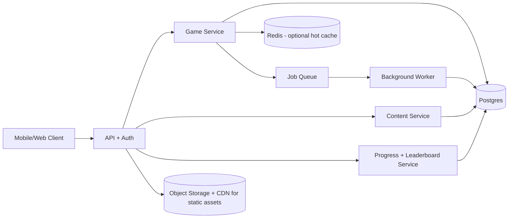
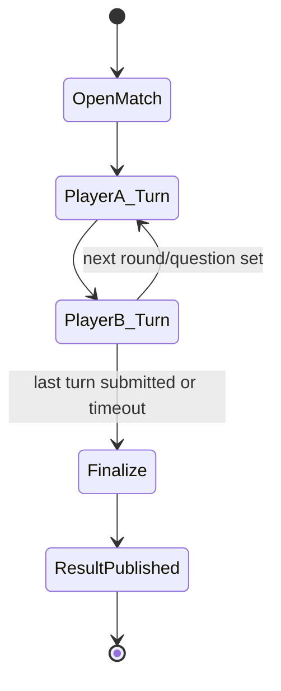

# Arena Masterplan — Lean Async-First Architecture (Month-1 Break-even)

**Version:** 2.0 (rewrite)
**Status:** Critique-ready draft
**Principle:** Build a profitable game loop first with **asynchronous turn-based matches**. Realtime is optional later, not a launch dependency.

---

## 1) Scope and Business Constraint

### 1.1 Product scope (Phase 1)
Launch a mobile/web learning battle mode where players:
1. Get matched (or challenge a friend)
2. Take the same question set in turn-based format
3. Receive score/result/rank updates
4. Return for daily progression (streak, rank, rewards)

### 1.2 Hard constraint: month-1 break-even
Architecture must minimize:
- always-on compute
- operational overhead
- complex anti-cheat/realtime infra

Success target (month 1):
- Positive contribution margin at low scale (first paying cohorts)
- Stable gameplay with low support burden

### 1.3 Explicit non-goals at launch
- No realtime socket combat
- No global sub-150ms gameplay SLA
- No team voice/chat
- No advanced ML fraud pipeline

---

## 2) Minimal System Components (Only What We Need)

### 2.1 Components
1. **Client (iOS/Android/Web):** polling-based state sync (no websocket requirement).
2. **API + Auth:** JWT sessions, rate limits, request signing for answer submissions.
3. **Game Service:** match creation, turn processing, scoring, result finalization.
4. **Content Service:** question retrieval/versioning.
5. **Progress/Leaderboard Service:** XP, streak, rank snapshots.
6. **Postgres (single primary):** source of truth.
7. **Redis (small):** cache + short-lived locks + idempotency keys (can be removed early if needed).
8. **Queue + Worker:** async jobs (result settlement, notifications, anti-cheat checks).
9. **Object Storage + CDN:** images/audio/static content.

### 2.2 Deployment stance
- Start **single region** (closest to core paying audience)
- Prefer **modular monolith** codebase with clear modules over microservices
- One DB cluster, one worker deployment, one API deployment

---

## 3) Turn-Based Game Flow (Async by Design)

### 3.1 Core loop

### 3.2 Operational flow
1. Player enters queue (or invites friend).
2. System creates match with fixed seed + fixed question set version.
3. Player A submits answers within time window (e.g., 2–12h per turn).
4. Player B gets notified and plays same set.
5. After both turns (or timeout), server finalizes score and winner.
6. Progress/rank/rewards applied asynchronously.

### 3.3 Why this works for month-1
- No persistent socket infrastructure
- Tolerates flaky mobile networks
- Easier cheat review (deterministic replay)
- Better timezone compatibility for early global users

---

## 4) Data Model (Trimmed to Essentials)

Keep only entities needed for billing, fairness, and gameplay.

### 4.1 Tables / entities
1. **users**
   - id, created_at, region, locale, age_band, status
2. **player_stats**
   - user_id, xp, level, streak_days, rating, updated_at
3. **question_sets**
   - id, subject, difficulty_band, version, seed, payload_ref
4. **matches**
   - id, mode, status(open/active/finalized/void), question_set_id, created_at, finalized_at
5. **match_players**
   - match_id, user_id, turn_order, submitted_at, total_score, time_spent_ms, outcome
6. **answers**
   - id, match_id, user_id, question_id, selected_option, correct, latency_ms, submitted_at
7. **economy_ledger**
   - id, user_id, type(xp/reward/penalty), delta, reason, ref_id, created_at
8. **anti_cheat_flags**
   - id, match_id, user_id, rule_code, severity, metadata_json, created_at, reviewed_at

### 4.2 Deliberately excluded in phase 1
- event-sourcing stream store
- per-question realtime telemetry firehose
- social graph service
- advanced inventory/cosmetics economy

---

## 5) Anti-Cheat (Basic but Practical)

Goal: block obvious abuse cheaply; escalate suspicious cases manually.

### 5.1 Server-authoritative rules
- Answer correctness scored only server-side
- Fixed question set + seed per match
- Turn deadline enforced server-side
- Idempotency key per submit request (prevents replay/double-submit)

### 5.2 Cheap heuristic checks
Flag (don’t auto-ban immediately) when:
- impossible completion speed (below human threshold)
- repeated near-perfect results with ultra-low latency pattern
- many accounts on same device fingerprint/IP burst
- abnormal win streak vs rating distribution

### 5.3 Actions
- Low severity: shadow-rank dampening / reduced rewards
- Medium: queue into high-risk pool + additional verification
- High: temporary hold on rewards + manual review

This is enough for launch without ML infrastructure.

---

## 6) Cost-Control Architecture (Month-1)

### 6.1 Infra assumptions (example: 8k MAU, 1.2k DAU, 6 matches/user/week)
Approx monthly baseline:
- API + worker compute (2 small instances + autoscale floor): **$90**
- Postgres managed small tier + backups: **$120**
- Redis small tier: **$35**
- Object storage + CDN egress (content-heavy but optimized): **$60**
- Monitoring/logging/error tracking: **$40**
- Email/push/SMS misc: **$30**

**Estimated total:** **$375/month** (target keep under **$500**)

### 6.2 Unit economics guardrail
- Infra cost target: **< $0.06 per MAU/month** at phase-1 scale
- If above threshold for 2 consecutive weeks: freeze feature work, optimize hotspots

### 6.3 Cost levers
1. Polling interval adaptive (active vs background)
2. Aggressive caching of question/media assets
3. Batch writes for non-critical analytics
4. Log sampling (full logs only for suspicious matches)
5. Daily cold data compaction

---

## 7) Rollout Gates (Ship in Controlled Steps)

### Gate 0 — Internal alpha
- 100–300 users
- Manual moderation only
- Success criteria: crash-free > 99%, match finalization success > 98%

### Gate 1 — Small paid cohort
- 1k–3k MAU
- Starter monetization active
- Success criteria: D7 retention target met, infra < $500/mo

### Gate 2 — Regional scale
- 5k–20k MAU
- Add queue segmentation + anti-cheat review workflow
- Success criteria: support tickets/match < target, fraud loss < 2% rewards

### Gate 3 — Realtime feasibility check
Only evaluate realtime after:
- Positive margin for 2+ consecutive months
- >= 25k MAU or >= 200 concurrent active matches at peak
- Async mode shows engagement ceiling

---

## 8) When to Introduce Realtime Later (Clear Triggers)

Introduce realtime incrementally, not as rewrite.

### 8.1 Trigger thresholds
Start realtime prototype when **all** are true:
1. Peak concurrent live sessions needs exceed polling UX tolerance (e.g., > 300 concurrent)
2. Match abandonment caused by async delay > target threshold
3. Budget can absorb +$800 to +$2,000/month infra increase
4. Engineering capacity available without risking core monetization roadmap

### 8.2 Technical path
1. Add optional realtime gateway for selected modes only
2. Keep async mode as fallback for low-bandwidth regions
3. Reuse same scoring and anti-cheat core logic
4. Gradually migrate high-value cohorts to realtime queues

---

## 9) Explicitly Deferred (Do Not Build Yet)

- Multi-region active-active gameplay
- Full microservice decomposition
- Kafka/Pulsar event backbone
- ML-based cheat detection
- UGC/social chat at scale
- Complex cosmetics marketplace
- Advanced school admin portal

Reason: none are required for month-1 break-even proof.

---

## 10) Risks and Mitigations (Critique-Ready)

1. **Risk:** Async gameplay feels less exciting than realtime.
   - **Mitigation:** short turn timers, instant result reveal, streak/rival systems.

2. **Risk:** Polling increases API load.
   - **Mitigation:** adaptive intervals, ETag/If-None-Match, lightweight payloads.

3. **Risk:** Basic anti-cheat misses sophisticated abuse.
   - **Mitigation:** reward holds + manual review + progressive rule updates.

4. **Risk:** Single region hurts far users.
   - **Mitigation:** async tolerance + CDN + defer realtime until justified.

---

## 11) Bottom Line

This architecture intentionally sacrifices realtime complexity to maximize:
- speed to launch
- operational simplicity
- month-1 break-even probability

It is not “less serious”; it is a staged strategy: **prove retention + monetization first, then buy complexity with revenue.**
