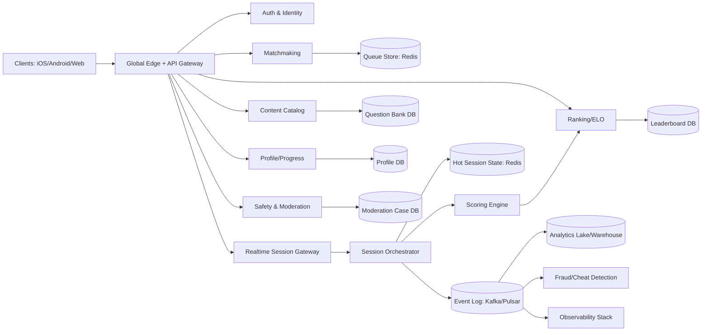
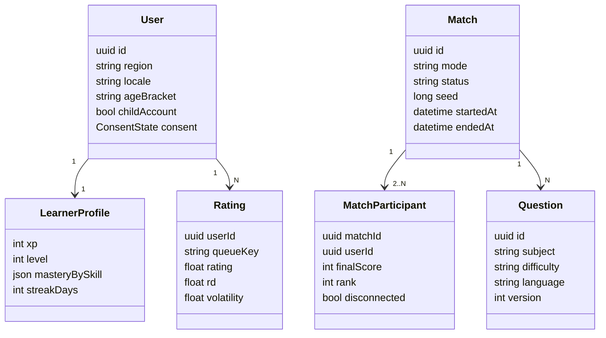
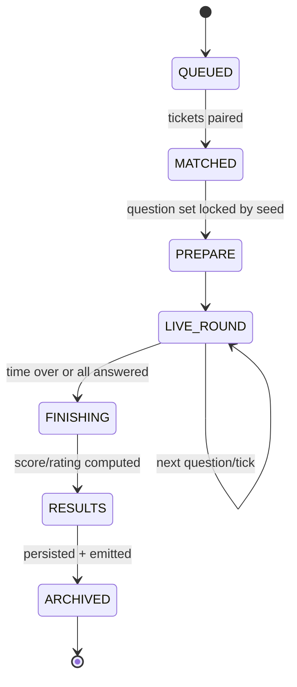
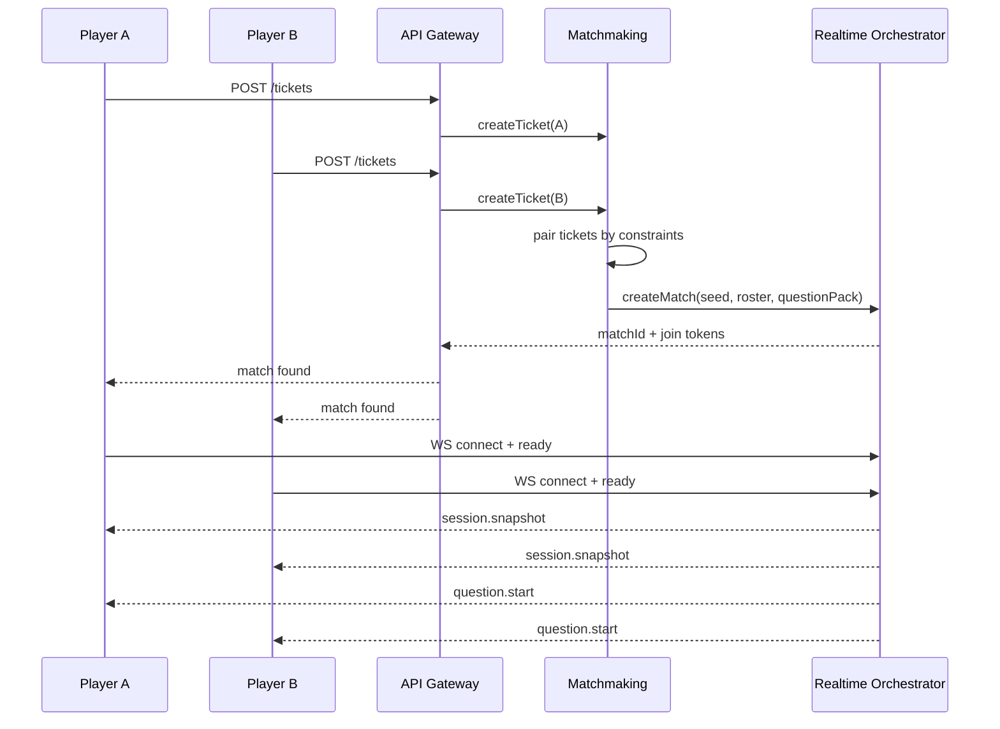
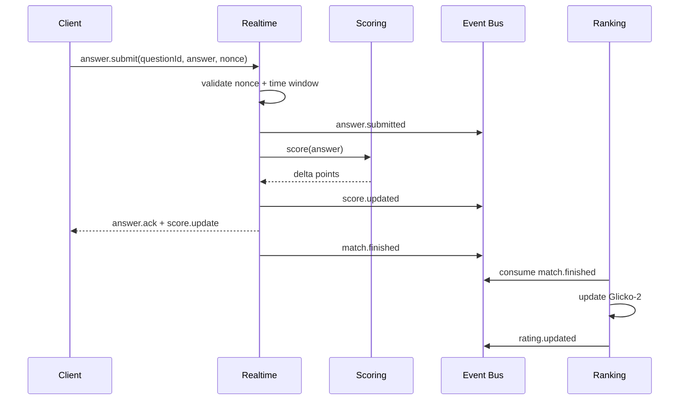

# Global Realtime Educational Battle Arena — Architecture Masterplan

**Version:** 1.0  
**Status:** Draft for architecture review  
**Scope:** English learning + multi-subject live quiz duels (1v1, squad, class tournaments)  
**Audience:** Product, Backend, Mobile/Web, Data, SRE, Security, Compliance

---

## 1) Vision and Product Constraints

### 1.1 Product vision
Build a **global, realtime, mobile-first learning battle arena** where learners compete in short quiz duels while improving language and general knowledge. Core value:
- Learning retention through spaced repetition + competition.
- Fun, short sessions (2–5 minutes) with social progression.
- Fair, safe, child-friendly global environment.

### 1.2 Non-negotiable constraints
1. **Low latency gameplay**: answer acknowledgment < 150ms regional p95; state updates < 300ms p95 in-region.
2. **Global operation**: multi-region routing, timezone-aware events, localized content.
3. **Child safety**: strict privacy defaults, moderation, parental controls, no open DMs by default.
4. **Fairness/anti-cheat**: deterministic question order per match seed, secure scoring, abuse detection.
5. **Resilience**: match continuity despite flaky mobile networks.
6. **Education first**: explain mistakes; XP should reward learning, not just speed.
7. **Cost discipline**: efficient at 0->1M MAU with staged complexity.

### 1.3 Target personas
- **Kids/Teens learners**: game-centric, quick sessions.
- **Parents**: safety + progress visibility.
- **Teachers/Schools**: cohort competitions, assignment-linked duels.
- **Casual adults**: ranked ladders + broad trivia.

### 1.4 Success metrics
- D1/D7 retention, avg sessions/day, match completion rate.
- Learning metrics: concept mastery uplift, wrong->right conversion.
- Fairness metrics: suspicious match ratio, smurf detection precision.
- Reliability: session crash-free rate, p95 latency, reconnect success.
- Safety: moderation SLA, report resolution time, underage policy adherence.

---

## 2) High-Level System Architecture



### 2.1 Architectural style
- **Domain-driven microservices** (modular monolith acceptable at phase 0; split by bounded context).
- **Event-driven backbone** for gameplay/audit/analytics.
- **Authoritative server** for match state and score.
- **CQRS-like read models** for leaderboards and progression dashboards.

---

## 3) Domain Model

### 3.1 Core aggregates
- **User**: age bracket, locale, region, safety flags, consent state.
- **LearnerProfile**: level, mastery map, streak, XP, inventory/cosmetics.
- **Question**: subject, difficulty, language, tags, version, validation status.
- **Match**: mode, seed, participants, round states, final result.
- **SessionEvent**: immutable event stream (join, answer, timeout, score_update, reconnect).
- **Rating**: per queue/mode ELO/Glicko snapshot.
- **Season**: leaderboard window and reward policy.
- **SafetyCase**: reports, automated flags, moderation action history.

### 3.2 Ubiquitous language
- **Arena Session** = one realtime match instance.
- **Queue** = matchmaking pool by mode/region/rating.
- **Round** = fixed question set slice (e.g., 10 questions / 90s).
- **Authority Tick** = server-validated progression step.



---

## 4) Service Boundaries (Bounded Contexts)

### 4.1 Identity & Access Service
- OAuth/email/phone/device auth.
- Child account flow, parental consent, COPPA/GDPR-K handling.
- JWT access token + rotating refresh token.
- Device fingerprint + risk score input.

### 4.2 Player Profile Service
- XP, levels, streaks, badges, mastery vectors.
- Inventory/cosmetics and progression economy.
- Idempotent reward application.

### 4.3 Content Service
- Question lifecycle: authoring -> review -> publish -> retire.
- Subject taxonomy, difficulty calibration, localization.
- Content versioning and A/B packs.

### 4.4 Matchmaking Service
- Queue ingest, ticket lifecycle, region-aware pairing.
- Backfill bots for wait-time SLA.
- Party/team matchmaking and skill spread constraints.

### 4.5 Realtime Session Service (Authoritative)
- Owns match simulation state machine.
- Validates answers/time windows.
- Emits canonical session events.

### 4.6 Scoring & Ranking Service
- Score aggregation with anti-cheat signals.
- Rating updates (Glicko-2 recommended for uncertainty).
- Leaderboard materialization (global/regional/friends/class).

### 4.7 Safety & Moderation Service
- Report ingestion, abuse scoring, auto-actions.
- Chat filters (if enabled), nickname screening, sanctions.

### 4.8 Analytics & Learning Intelligence
- Event ingestion -> warehouse -> feature computation.
- Learning diagnostics and recommendation feeds.

### 4.9 Notification Service
- Push/inbox reminders, season events, parental summaries.
- Quiet hours + legal communication constraints for minors.

---

## 5) Realtime Game Session Architecture

### 5.1 Match lifecycle


### 5.2 Session internals
- **Session Orchestrator**: one authoritative worker per match (sticky).
- **Hot state** in Redis (TTL + snapshot every N events).
- **Event append** to Kafka/Pulsar with monotonic sequence.
- **Recovery**: on worker failover, replay event log + latest snapshot.

### 5.3 Latency handling
- Client sends answer with local timestamp + question nonce.
- Server decides authoritative acceptance by server clock window.
- Optional **client-side optimistic animation**; reconcile on authoritative event.
- Clock sync hints distributed at session start.

### 5.4 Disconnection strategy
- Grace period (e.g., 12s) for reconnect without hard forfeit.
- Missed events catch-up via sequence replay.
- Persistent disconnect -> AI autopilot or abandonment policy by mode.

---

## 6) Matchmaking Design

### 6.1 Queue keys
`queueKey = mode + subject_pool + region + platform_bucket + rating_bucket + age_bracket`

### 6.2 Ticket model
- userId, partyId, queueKey, ratingMu, ratingSigma, preferredLang, ping profile, constraints.

### 6.3 Pairing algorithm (hybrid)
1. Strict window at enqueue (rating ±50, ping < 80ms).
2. Expand windows over wait time.
3. Cross-region if queue starved (cap max RTT).
4. Bot insertion after SLA threshold.

### 6.4 Fairness constraints
- Avoid repeat opponents within recent N matches.
- Smurf-protected pools for new accounts.
- Child account protected queues (no open adult pools if policy requires).

### 6.5 Team modes
- Party MMR = weighted mean + uncertainty penalty.
- Roleless balancing for quiz mode; class/team balancing by aggregate mastery.

---

## 7) Anti-Cheat & Fair Play

### 7.1 Threat model
- Answer automation/bots.
- Rooted device tampering.
- Collusion / win-trading.
- Multi-account smurfing.
- Network manipulation (lag switch/replay).

### 7.2 Controls
- Server-authoritative timing/scoring.
- Per-question signed nonce; reject replays.
- Rate limits and behavior anomaly scoring.
- Device integrity attestations (Play Integrity / DeviceCheck).
- Challenge-response checks for suspicious sessions.
- Delayed leaderboard finalization for high-risk matches.

### 7.3 Detection features
- Reaction-time distribution impossible patterns.
- Accuracy jump vs historical mastery.
- Graph-based collusion (repeated pair outcomes).
- IP/device/account graph risk scoring.

### 7.4 Enforcement ladder
- Soft shadow pool -> warning -> temporary rank lock -> suspension -> ban.
- Appeals workflow via moderation portal.

---

## 8) Rank / ELO System

### 8.1 Recommended model
Use **Glicko-2** per queue/mode due to uncertainty handling and sparse games.
- `rating (mu)`, `deviation (phi)`, `volatility (sigma)`.
- New users start high uncertainty; settle quickly.

### 8.2 Update timing
- Rating updates at match finalization event.
- Provisional period (first 20 games) with accelerated movement.

### 8.3 Seasonal design
- 4–8 week seasons.
- Soft reset formula (toward mean with cap).
- Reward tiers by percentile + anti-abuse guardrails.

### 8.4 Smurf mitigation
- Hidden MMR converges fast; visible rank lags slightly.
- Suspicious dominance triggers accelerated calibration.

---

## 9) Event Sourcing & Data Flow

### 9.1 Why event sourcing here
- Auditability for disputes/cheat investigations.
- Replay for bug fixes and simulation testing.
- Clean analytics feed with immutable facts.

### 9.2 Event taxonomy (examples)
- `match.created`, `match.started`, `player.joined`, `question.presented`, `answer.submitted`, `answer.accepted`, `score.updated`, `player.disconnected`, `match.finished`, `rating.updated`, `reward.granted`, `report.filed`.

### 9.3 Envelope contract
```json
{
  "event_id": "uuid",
  "event_type": "answer.submitted",
  "occurred_at": "2026-03-15T10:00:00Z",
  "producer": "realtime-session-service",
  "aggregate_type": "match",
  "aggregate_id": "match_uuid",
  "seq": 142,
  "schema_version": 3,
  "payload": {},
  "trace_id": "otel-trace-id"
}
```

### 9.4 Stream partitioning
- Partition by `match_id` for order guarantee within match.
- Secondary topics for user-centric projections.

### 9.5 Idempotency
- Consumers use `event_id` dedupe table/cache.
- Upserts with version checks on projections.

---

## 10) Data Model (Relational + Redis + Lake)

> Suggested primary OLTP: **PostgreSQL** (regional primary + read replicas), **Redis** for hot state/cache, **Object storage + warehouse** for analytics.

### 10.1 Core SQL tables (simplified)

#### `users`
- `id (uuid, pk)`
- `created_at, updated_at`
- `region_code, locale`
- `age_bracket`
- `child_account (bool)`
- `status (active/suspended/deleted)`

#### `consents`
- `id (uuid)`
- `user_id (fk users)`
- `consent_type (tos/privacy/parental)`
- `version`
- `granted_at, revoked_at`

#### `profiles`
- `user_id (pk)`
- `display_name`
- `xp, level, streak_days`
- `avatar_id`
- `mastery_jsonb`

#### `questions`
- `id (uuid)`
- `subject`
- `skill_tag`
- `difficulty`
- `language`
- `content_jsonb`
- `correct_answer_hash`
- `version`
- `status (draft/review/published/retired)`

#### `matches`
- `id (uuid)`
- `mode`
- `queue_key`
- `region`
- `seed bigint`
- `status`
- `started_at, ended_at`

#### `match_participants`
- `match_id, user_id (composite pk)`
- `team_id`
- `final_score`
- `accuracy`
- `avg_response_ms`
- `result (win/loss/draw)`
- `disconnect_count`

#### `match_rounds`
- `id (uuid)`
- `match_id (fk)`
- `round_index`
- `question_ids jsonb`
- `started_at, ended_at`

#### `ratings`
- `user_id, queue_key (pk)`
- `mu, phi, sigma`
- `matches_played`
- `updated_at`

#### `leaderboard_entries`
- `season_id`
- `board_key`
- `user_id`
- `score`
- `rank`
- `updated_at`

#### `reports`
- `id`
- `reporter_user_id`
- `target_user_id`
- `match_id`
- `reason_code`
- `evidence_jsonb`
- `status`

### 10.2 Redis structures
- `queue:{queueKey}` sorted set (ticket score by enqueue time + mmr proximity).
- `match:{id}:state` hash/json.
- `match:{id}:events` capped list for fast replay.
- `presence:{userId}` for online/session binding.

### 10.3 Analytics tables (warehouse)
- `fact_match_events`, `fact_answers`, `fact_sessions`, `dim_user`, `dim_question`, `fact_moderation`.

---

## 11) API Contracts (HTTP/gRPC)

### 11.1 Auth/Profile
- `POST /v1/auth/login`
- `POST /v1/auth/refresh`
- `GET /v1/profile/me`
- `PATCH /v1/profile/me`

### 11.2 Matchmaking
- `POST /v1/matchmaking/tickets` create queue ticket
- `DELETE /v1/matchmaking/tickets/{ticketId}` cancel
- `GET /v1/matchmaking/tickets/{ticketId}` status

**Create ticket request**
```json
{
  "mode": "duel_ranked",
  "subjectPool": ["english_vocab", "science_basic"],
  "regionPreference": "sg",
  "partyId": null,
  "clientPingMs": {"sg": 45, "jp": 89}
}
```

**Response**
```json
{
  "ticketId": "uuid",
  "queueKey": "duel_ranked:mix:sg:mobile:bronze:teen",
  "estimatedWaitSec": 12
}
```

### 11.3 Match session bootstrap
- `POST /v1/matches/{matchId}/join-token` -> short-lived WS token.
- `GET /v1/matches/{matchId}` -> summary/result.

### 11.4 Ranking/Leaderboards
- `GET /v1/rank/me?queueKey=...`
- `GET /v1/leaderboards/{boardKey}?seasonId=...&cursor=...`

### 11.5 Content delivery (read-optimized)
- `GET /v1/content/subjects`
- `GET /v1/content/recommendations`

### 11.6 Moderation
- `POST /v1/reports`
- `GET /v1/safety/actions/me`

---

## 12) WebSocket Protocol (Realtime)

### 12.1 Connection
- Endpoint: `wss://rt.example.com/v1/session?matchId=...`
- Auth: signed short-lived session JWT (<= 2 min issuance window).

### 12.2 Message envelope
```json
{
  "t": "answer.submit",
  "id": "client-msg-uuid",
  "seq": 17,
  "ts": 1710000000123,
  "body": {}
}
```

### 12.3 Client -> Server events
- `ready`
- `answer.submit {questionId, answer, nonce}`
- `emoji {type}` (safe preset only)
- `ping`
- `reconnect.resume {lastServerSeq}`

### 12.4 Server -> Client events
- `session.snapshot`
- `question.start`
- `answer.ack`
- `score.update`
- `player.state`
- `round.end`
- `match.result`
- `moderation.notice`
- `error`

### 12.5 Reliability semantics
- At-least-once delivery from server, client dedupe by `serverSeq`.
- Client commands idempotent by `id`.
- Heartbeat every 10s, timeout at 30s.

### 12.6 Example `question.start`
```json
{
  "t": "question.start",
  "serverSeq": 81,
  "body": {
    "questionId": "q_123",
    "prompt": "Choose the correct synonym for 'rapid'",
    "options": ["slow", "fast", "quiet", "late"],
    "timeLimitMs": 8000,
    "nonce": "signed_nonce"
  }
}
```

---

## 13) Mobile/Web Shared Architecture

### 13.1 Client strategy
- Shared domain layer in **TypeScript**:
  - protocol models
  - state reducers
  - validation & event codecs
- Web: Next.js + React.
- Mobile: React Native (or Flutter alt path), reuse protocol/state libs.

### 13.2 Client architecture pattern
- Feature modules: auth, queue, match, profile, leaderboard.
- State: finite-state machine for match lifecycle.
- Offline support: queued non-realtime actions (profile/customization), not ranked matches.

### 13.3 Rendering/UX constraints
- 60fps target on mid-tier devices.
- Minimal payload question objects.
- Accessibility: dyslexia-friendly font option, audio prompts, color-safe palette.

### 13.4 App release controls
- Remote config + feature flags.
- Kill-switch for risky features and problematic question packs.

---

## 14) CI/CD & Release Engineering

### 14.1 Branching and environments
- `main` -> staging -> production promotion.
- Ephemeral preview env per PR.
- Infra as code (Terraform/Pulumi).

### 14.2 Pipeline stages
1. Lint/type/unit tests.
2. Contract tests (API + WS schemas).
3. Integration tests (match simulation deterministic tests).
4. Security scans (SAST, dependency, secrets).
5. Load tests for matchmaking/session hotspots.
6. Deploy canary 5% -> 25% -> 100% (automated guardrails).

### 14.3 Schema and event evolution
- Backward-compatible event schema policy.
- DB migration with expand/contract pattern.
- Consumer-driven contracts mandatory for critical streams.

---

## 15) Observability & SRE

### 15.1 Telemetry stack
- OpenTelemetry instrumentation everywhere.
- Metrics: Prometheus + long-term TSDB.
- Logs: structured JSON with trace IDs.
- Traces: Jaeger/Tempo.

### 15.2 Golden signals
- Latency: matchmaking, WS round-trip, scoring finalize.
- Traffic: active sessions, enqueue rate, event throughput.
- Errors: dropped WS messages, failed joins, invalid answer rejects.
- Saturation: Redis memory, broker lag, CPU per session worker.

### 15.3 SLOs (initial)
- Match join success: **99.5%**
- Match completion without fatal error: **99.0%**
- Reconnect recovery (<15s): **97%**
- API availability (non-realtime): **99.9%**

### 15.4 On-call and incident response
- Service ownership map + runbooks.
- Paging thresholds tied to SLO burn rates.
- Game-impact severity matrix (SEV1/SEV2).

---

## 16) Reliability, DR, and Multi-Region

### 16.1 Regional topology
- Active-active across primary regions (e.g., Singapore, Frankfurt, Virginia).
- Players routed by latency + policy.
- Match pinned to one region for duration.

### 16.2 Stateful components strategy
- Redis: regional clusters with persistence + failover.
- PostgreSQL: regional writer + read replicas; asynchronous cross-region replication.
- Event bus: multi-AZ per region; mirror critical topics cross-region.

### 16.3 Disaster recovery
- RPO targets:
  - Match events: near-zero (event log durable replication)
  - Profile/rating: < 1 minute
- RTO targets:
  - Realtime service region failover: < 15 minutes (new matches)
  - Full control plane recovery: < 60 minutes

### 16.4 Chaos testing
- Inject broker delays, Redis failovers, packet loss on WS.
- Validate reconnect/replay correctness and rating consistency.

---

## 17) Security, Privacy, Child Safety, Compliance

### 17.1 Security baseline
- Zero-trust service auth (mTLS + workload identity).
- Secrets in vault, short-lived creds.
- Encryption at rest (KMS) + TLS 1.2+ in transit.
- WAF + bot protection at edge.

### 17.2 Privacy by design
- Data minimization (no unnecessary PII in gameplay path).
- Pseudonymous IDs in analytics.
- Region-aware data residency controls.
- Right-to-access/delete workflows.

### 17.3 Child safety controls
- Age gates and parent consent workflows.
- Safe preset communications only (or no chat for minors).
- Profanity/toxicity filtering for names/content.
- Report/Block/Appeal with quick moderation SLA.

### 17.4 Compliance targets
- COPPA (US children), GDPR/GDPR-K (EU), UK AADC, local PDPA variants.
- Audit logs immutable and retained per policy.
- DPIA and threat modeling as release gates for new features.

---

## 18) Scaling Plan: 0 -> 1M MAU

### Phase 0 (0–20k MAU)
- Modular monolith for non-realtime + dedicated realtime service.
- Single region + CDN edge.
- Managed Postgres/Redis/Kafka.
- Focus: product-market fit, instrumentation correctness.

### Phase 1 (20k–150k MAU)
- Split matchmaking/ranking/content services.
- Add second region for latency and resilience.
- Introduce warehouse + feature store basics.
- Mature anti-cheat heuristics.

### Phase 2 (150k–500k MAU)
- Active-active regions for realtime.
- Dedicated event platform team, schema governance.
- Advanced moderation tooling and trust/risk models.
- ML-assisted personalization for question selection.

### Phase 3 (500k–1M+ MAU)
- Full global routing optimization and regional shards.
- Stateful session autoscaling with predictive pre-warm.
- Cost/perf tuning: spot mix, tiered storage, stream compaction.
- Enterprise/school tenancy controls and SLAs.

### Capacity planning heuristics
- Peak CCU ~ 8–12% of DAU during event windows.
- 1 match worker handles N concurrent matches by mode complexity.
- Size Redis for 2x hot match state + failover headroom.

---

## 19) Technical Risks and Mitigations

| Risk | Impact | Likelihood | Mitigation |
|---|---|---:|---|
| Cross-region latency variance harms fairness | High | Medium | Region-pinned matches, RTT caps, dynamic queue expansion with fairness scoring |
| Event schema drift breaks consumers | High | Medium | Schema registry, compatibility checks in CI, canary consumers |
| Cheaters evade static rules | High | High | Layered detection + adaptive models + delayed rewards for risky sessions |
| Ranking instability for new users | Medium | High | High-uncertainty model, provisional queues, smurf acceleration |
| Child safety incident | Critical | Medium | Strict defaults, proactive moderation, auditable enforcement, rapid escalation playbook |
| Reconnect edge cases desync match state | High | Medium | Sequence-based replay, deterministic state machine tests, chaos network tests |
| Cost explosion from always-on realtime infra | High | Medium | Autoscaling + queue-aware prewarm + right-sized regions and bot fallback controls |
| Content quality inconsistency across languages | Medium | Medium | Editorial workflow, calibration metrics, localized QA, retire-on-complaint policy |

---

## 20) Sequence Diagrams

### 20.1 Queue to match start


### 20.2 Answer and scoring


---

## 21) Implementation Blueprint (First 2 Quarters)

### Quarter 1
- Build identity/profile/content foundations.
- Ship 1v1 ranked duel MVP with English + one extra subject.
- Implement authoritative realtime + basic matchmaking.
- Add baseline telemetry, dashboards, and incident runbooks.

### Quarter 2
- Add seasonal leaderboard and party queue.
- Introduce anti-cheat v1 + moderation workflows.
- Launch second region and reconnect hardening.
- Deploy warehouse models for learning effectiveness and churn risk.

---

## 22) Open Decisions (for architecture review)

1. **Protocol choice**: pure WS JSON vs binary protobuf over WS for bandwidth.
2. **Rating model**: Glicko-2 default vs TrueSkill for team-heavy roadmap.
3. **Mobile stack**: React Native shared code vs native clients with shared schema libs.
4. **Event platform**: Kafka vs Pulsar tradeoff by ops maturity.
5. **Data residency**: per-tenant strict residency vs global logical shards.
6. **Bot policy**: disclosed vs undisclosed fallback bots by age cohort.

---

## 23) Definition of Done for this Architecture
- [ ] Latency/SLO targets ratified by Product + SRE.
- [ ] Security/privacy/legal review completed.
- [ ] API + WS schemas versioned and contract-tested.
- [ ] Event schema registry and governance live.
- [ ] Capacity model validated with synthetic load.
- [ ] Incident game-day simulation passed.

---

## Appendix A — Suggested Tech Stack (Pragmatic)
- **Backend:** TypeScript (NestJS/Fastify) + Go for hot-path realtime if needed.
- **Realtime:** WS gateway + authoritative session workers.
- **Data:** Postgres, Redis, Kafka/Pulsar, S3/GCS + BigQuery/Snowflake.
- **Infra:** Kubernetes + Istio/Linkerd, Terraform, ArgoCD/GitHub Actions.
- **Observability:** OpenTelemetry, Prometheus, Grafana, Tempo/Jaeger, Loki.
- **Security:** OPA policy checks, Vault, WAF/CDN, SIEM integration.

## Appendix B — Example Queue Expansion Rules
- 0–10s: rating ±50, ping <=80ms, same region.
- 10–20s: rating ±100, ping <=120ms, adjacent region.
- 20–35s: rating ±150, ping <=150ms.
- 35s+: allow bot fill (except protected educational cohorts if policy forbids).

---

This document is intentionally concrete and critique-ready. It should be paired with:
1) API specification repository (OpenAPI + AsyncAPI),
2) threat model document,
3) load/perf test plan,
4) rollout playbook per phase.
